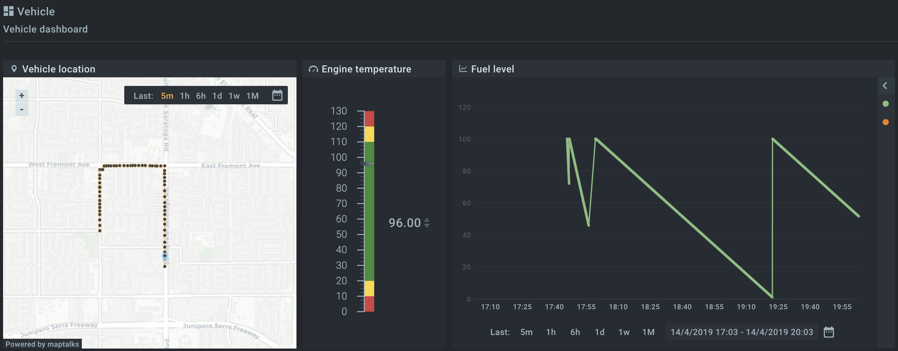



* TOC
{:toc}

In this tutorial, we will look at how to collect telemetry data from a simulated device to the Kaa platform. We will learn how to transform 
collected data into well-structured [time series](https://en.wikipedia.org/wiki/Time_series) and visualize it on the Kaa web interface. 


# Overview

We will simulate the fleet management scenario. Our [endpoint]({{docs_url}}DOC/docs/current/Kaa-concepts/#endpoints) will act as a device, which is integrated into a vehicle, and reports its 
location (latitude and longitude), engine temperature and fuel level to the Kaa platform.

Also, we will configure [Web Dashboard]({{docs_url}}WD) with the [Endpoint Location]({{docs_url}}WD/docs/current/Widgets/Map/) widget for historical and realtime vehicle location, 
[Gauge]({{docs_url}}WD/docs/current/Widgets/Gauge/) widget for the current engine temperature and [Multi Series Chart]({{docs_url}}WD/docs/current/Widgets/Multi-series-chart/) widget for the fuel level.


# Prerequisites

1. You know [how to connect a device]({{docs_url}}Tutorials/docs/current/how-to-connect-device/) to the Kaa platform.
2. The Kaa platform is up and running with the following microservices included:
* [Kaa Protocol Communication (KPC)]({{docs_url}}KPC);
* [Credential Management (CM)]({{docs_url}}CM);
* [Data Collection Extension (DCX)]({{docs_url}}DCX);
* [Endpoint Time Series (EPTS)]({{docs_url}}EPTS);
* [Endpoint Register (EPR)]({{docs_url}}EPR);
* [Web Dashboard (WD)]({{docs_url}}WD).
3. [Python 2.7](https://www.python.org/download/releases/2.7/) is installed on your machine.


# Playbook

**1**. Open Kaa Cluster [blueprint]({{docs_url}}DOC/docs/current/Kaa-concepts/#blueprint) and configure [EPTS]({{docs_url}}EPTS/docs/current/Configuration/#time-series-definition) service with the `Temperature`, `FuelLevel` and `Location` time series:

```yaml
kaa:
  applications:
    demo_application:
      time-series:
      - name: Temperature
        value-field: temperature
      - name: FuelLevel
        value-field: fuelLevel
      - name: Location
        value-field: timestamp
        tag-fields:
        - name: latitude
          required: true
        - name: longitude
          required: true
      versions:
        demo_application_v1:
          extraction:
            timestamp:
              path: "$.timestamp"         # JSON Path of the timestamp field in data sample 
              format: millis-unix-epoch   # Timestamp format
              fallback-strategy: server-timestamp  # Take server timestamp if it is not present in data sample
            extract-all: true             # Extract all properties from data sample 
```

Here `demo_application` [application]({{docs_url}}DOC/docs/current/Kaa-concepts/#application) has three time series: 
- `Temperature` with `temperature` value field;
- `FuelLevel` with `fuelLevel` value field;
- `Location` with `timestamp` value field and required `latitude`, `longitude` tag fields.

Also, configuration has data sample structure description for the devices in `demo_application_v1` [application version](({{docs_url}}DOC/docs/current/Kaa-concepts/#application)).

The timestamp is accessible by `$.timestamp` JSON path. It is in UNIX format in milliseconds and 
if it is not present EPTS should fall back to the timestamp of when data sample was received by the platform.

Read more about EPTS time series configuration [here]({{docs_url}}EPTS/docs/current/Configuration/).      

**2**. Run [Python simulator `client.py`](https://github.com/kaaproject/tutorials/blob/master/doc/data-collection/attach/code/client.py)
that simulates our vehicle.

```
python -t myToken -h {host} -p {port} client.py

INFO: Using EP token myToken, server at {host}:{port}
DEBUG: Composed data collection topic: kp1/demo_application_v1/dcx/myToken/json/23
INFO: Connecting to KPC instance at {host}:{port}...
INFO: Successfully connected
DEBUG: myToken: Sent next data: [{"latitude": 37.35119, "timestamp": 1555230312868, "temperature": 98, "longitude": -122.03248, "fuelLevel": 100}]
INFO: Message received: topic [kp1/demo_application_v1/dcx/myToken/json/23/status]
body []
...
```

**3**. Go to Web Dashboard and configure [Endpoint Location]({{docs_url}}WD/docs/current/Widgets/EP-Location/) widget to display current vehicle location.

<div align="center">
  <iframe width="640" height="385" src="https://www.youtube.com/embed/6T2F6gGupWg?rel=0" frameborder="0" 
    allow="accelerometer; autoplay; encrypted-media; gyroscope; picture-in-picture" allowfullscreen></iframe>
</div>

**4**. Go to Web Dashboard and configure [Gauge]({{docs_url}}WD/docs/current/Widgets/Gauge/) widget to display current vehicle engine temperature.

<div align="center">
  <iframe width="640" height="385" src="https://www.youtube.com/embed/jbVPhQtKRLY?rel=0" frameborder="0" 
    allow="accelerometer; autoplay; encrypted-media; gyroscope; picture-in-picture" allowfullscreen></iframe>
</div>

**5**. Go to Web Dashboard and configure [Multi Series Chart]({{docs_url}}WD/docs/current/Widgets/Multi-series-chart/) widget to display current vehicle fuel level.

<div align="center">
  <iframe width="640" height="385" src="https://www.youtube.com/embed/Tz6ZbTAs8XQ?rel=0" frameborder="0" 
    allow="accelerometer; autoplay; encrypted-media; gyroscope; picture-in-picture" allowfullscreen></iframe>
</div>

Now you can monitor vehicle location, fuel level and engine temperature in real time.




# Resources

All tutorial resources are located on [GitHub](https://github.com/kaaproject/tutorials/tree/master/doc/data-collection/attach/code). 
