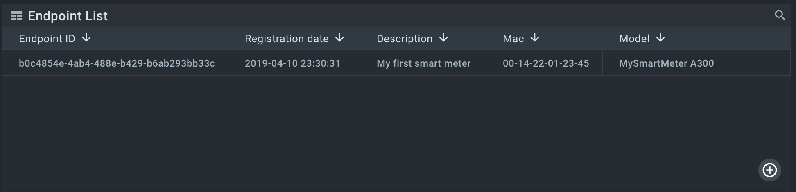



* TOC
{:toc}


# Overview


We will simulate a smart energy scenario. Our [endpoint](https://github.com/kaaproject/kaa-rfcs/blob/master/0001/README.md#language) 
will act as a smart meter and report its model and mac address to the Kaa platform.
Also, we will configure [Endpoint List widget]({{docs_url}}WD/docs/current/Widgets/Ep-list/) on [Web Dashboard]({{docs_url}}WD/docs/current/Overview/) to display newly connected endpoint with its reported metadata.


# Prerequisites

1. The Kaa platform is up and running with the next microservices:
* [Kaa Protocol Communication (KPC)]({{docs_url}}KPC/docs/current/Overview/);
* [Credential Management (CM)]({{docs_url}}CM/docs/current/Overview/);
* [Endpoint Metadata Extension (EPMX)]({{docs_url}}EPMX/docs/current/Overview/);
* [Endpoint Register (EPR)]({{docs_url}}EPR/docs/current/Overview/);
* [Web Dashboard (WD)]({{docs_url}}WD/docs/current/Overview/).


# Background information

Kaa by default uses an **MQTT-based transport protocol**: [Kaa Protocol (1/KP)](https://github.com/kaaproject/kaa-rfcs/blob/master/0001/README.md).
1/KP acts as a multiplexing protocol and allows running higher level (extension) protocols on top of it.
Extension protocols enable data exchange between endpoints and extensions, which are Kaa microservices and implement different aspects of the server-side functionality, 
such as **metadata synchronization** ([EPMX]({{docs_url}}EPMX/docs/current/Overview/)), **data collection** ([DCX]({{docs_url}}DCX/docs/current/Overview/)), **configuration management** ([CMX]({{docs_url}}CMX/docs/current/Overview/)), etc.

Managed devices are represented as [endpoints]({{docs_url}}DOC/docs/current/Kaa-concepts/#endpoints) in the Kaa platform.
1/KP uses endpoint tokens (alphanumeric strings) to identify connected endpoints.
Every managed device should have a **separate endpoint token** for communicating with the platform.

Typically, every extension defines its own **MQTT path and payload** structure to be used by endpoints.
In this demo scenario we use only one **extension**:
* [EPMX]({{docs_url}}EPMX/docs/current/Overview/) -- for metadata synchronization. Check its extension protocol [10/EPMP](https://github.com/kaaproject/kaa-rfcs/blob/master/0010/README.md) for more information.


# Playbook

**1**. Go to Web Dashboard and configure (if it is not already configured) [Endpoint List widget]({{docs_url}}WD/docs/current/Widgets/Ep-list/).
Add `meterDescription` field to an endpoint creation form. We will fill it during endpoint record creation.

<div align="center">
  <iframe width="640" height="385" src="https://www.youtube.com/embed/qMeLZa0emws?rel=0" frameborder="0" 
    allow="accelerometer; autoplay; encrypted-media; gyroscope; picture-in-picture" allowfullscreen></iframe>
</div>

**2**. Create endpoint record and get an endpoint token with the previously configured widget:

<div align="center">
  <iframe width="640" height="385" src="https://www.youtube.com/embed/du7tBJY72xM?rel=0" frameborder="0" 
    allow="accelerometer; autoplay; encrypted-media; gyroscope; picture-in-picture" allowfullscreen></iframe>
</div>

**3**. Run [client.py](https://github.com/kaaproject/tutorials/blob/master/doc/how-to-connect-device/attach/code/client.py) passing endpoint token, platform host and port as its argument:

```
python -t myToken -h {host} -p {port} client.py

INFO: Using EP token myToken, server at {host}
DEBUG: Composed metadata topic: kp1/demo_application_v1/epmx/myToken/update/keys
INFO: Connecting to KPC instance at {host}:{port}...
INFO: Successfully connected
INFO: Sent metadata: {"model": "MySmartMeter A300", "mac": "00-14-22-01-23-45"}

INFO: Disconnecting from server at {host}:{port}.
INFO: Successfully disconnected
```

**4**. Go to Web Dashboard and configure Endpoint List widget with metadata columns:

<div align="center">
  <iframe width="640" height="385" src="https://www.youtube.com/embed/ozMnDBzknHQ?rel=0" frameborder="0" 
    allow="accelerometer; autoplay; encrypted-media; gyroscope; picture-in-picture" allowfullscreen></iframe>
</div>

Now our device is listed in Endpoint List widget along with its metadata:



# Resources

All tutorial resources are located on [GitHub](https://github.com/kaaproject/tutorials/tree/master/doc/how-to-connect-device/attach/code).
